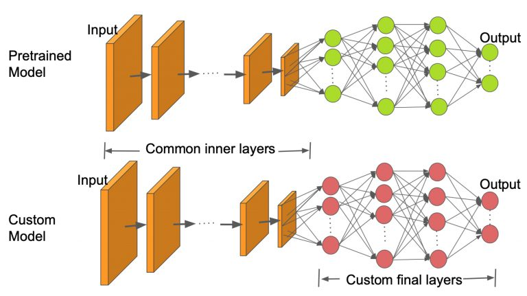

# Computer_vision

#### Introduction: 

Wheat rust is a devastating plant disease that affects many African crops, reducing yields and affecting the livelihoods of farmers and decreasing food security across the continent. The disease is difficult to monitor at a large scale, making it difficult to control and eradicate.

The objective of this challenge is to build a machine learning algorithm to correctly classify if a plant is healthy, has stem rust, or has leaf rust.

An accurate image recognition model that can detect wheat rust from any image will enable a crowd-sourced approach to monitoring African crops, through avenues such as social media and smartphone images. This challenge represents a potential breakthrough in our ability to monitor and control plant diseases like wheat rust that affect African livelihoods

[Reference data](https://zindi.africa/competitions/iclr-workshop-challenge-1-cgiar-computer-vision-for-crop-disease/data)

#### Methodology

- This problem was addressed by using pretrained model in recognising the state of the wheat. In the first case, VGG-16 model was used by restructuring the classifier layers to suit the problem we want to address. VGG-16 model has been trained on large datasets in different domain. We tend to use the same weights of that model in the convolution part. The image shows the nature of transfer learning structure. . 
- Detail of the source code .

